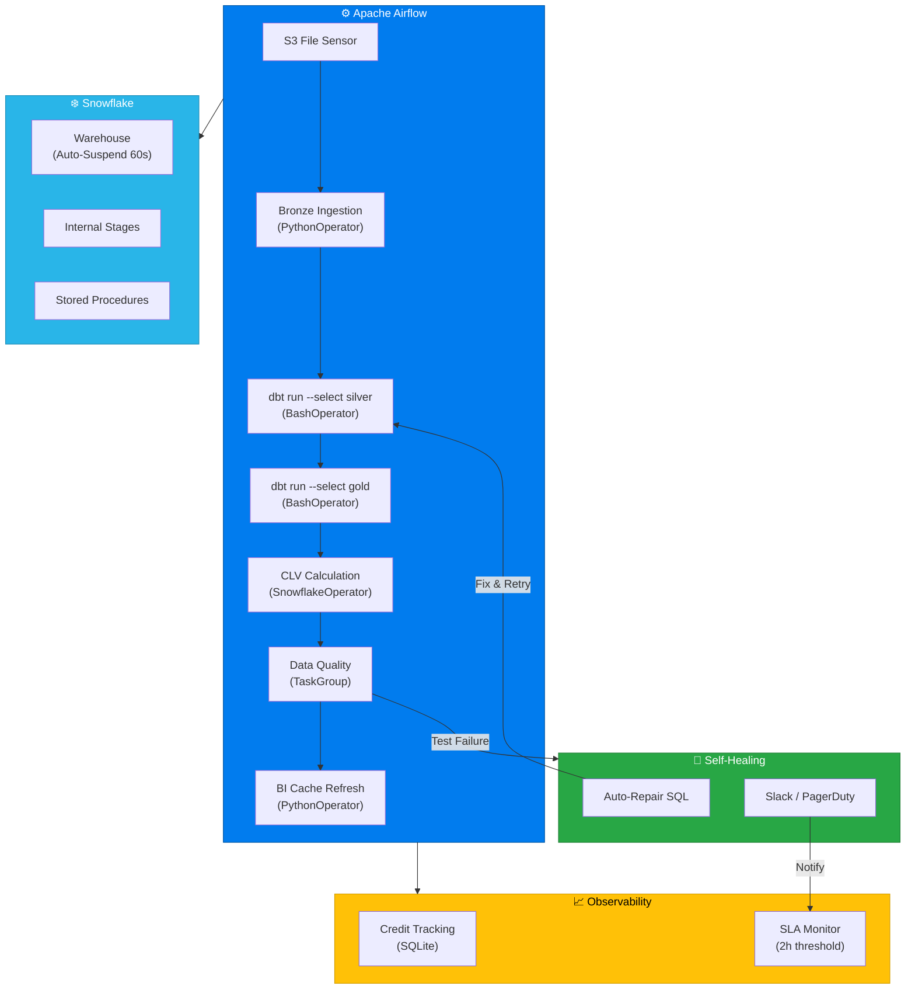
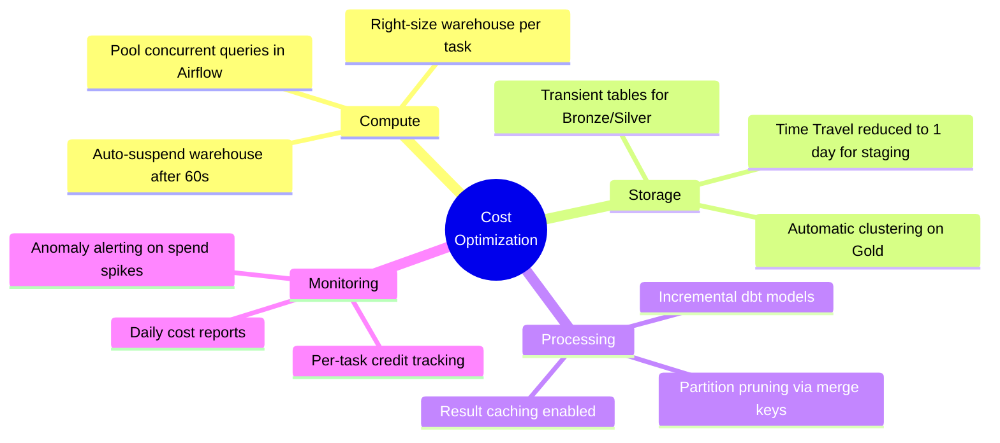
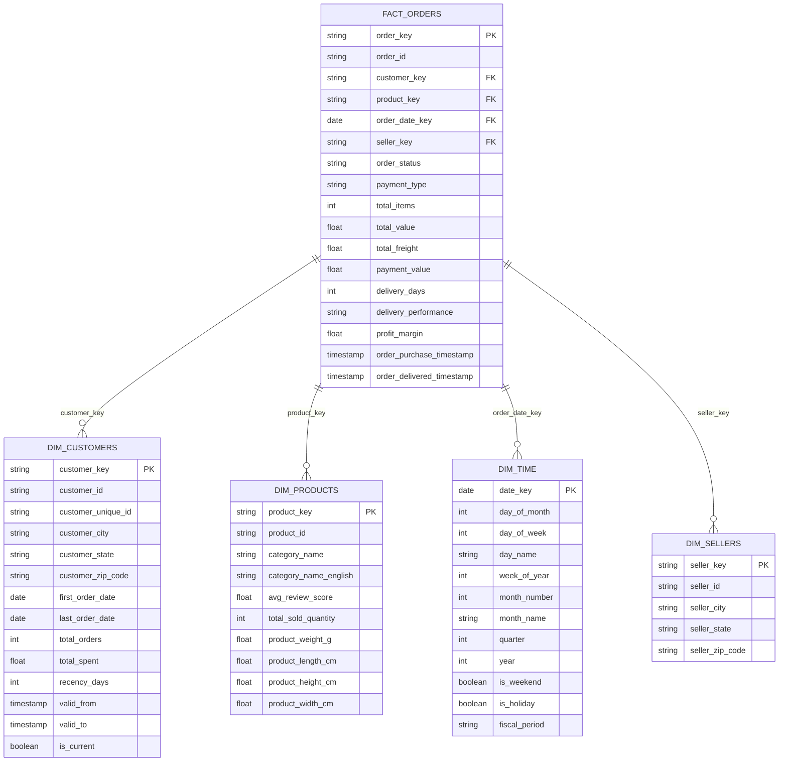

# Architecture Documentation

## 1. End-to-End Data Flow (Medallion Architecture)

```mermaid
flowchart LR
    subgraph Sources["📥 Data Sources"]
        S3["AWS S3\n(Raw CSV/JSON)"]
    end

    subgraph Bronze["🥉 Bronze Layer"]
        direction TB
        B_Orders["orders\n(VARIANT)"]
        B_Customers["customers\n(VARIANT)"]
        B_Products["products\n(VARIANT)"]
        B_Items["order_items\n(VARIANT)"]
        B_Payments["payments\n(VARIANT)"]
        B_Geo["geolocation\n(VARIANT)"]
        B_Reviews["reviews\n(VARIANT)"]
        B_Sellers["sellers\n(VARIANT)"]
    end

    subgraph Silver["🥈 Silver Layer"]
        direction TB
        S_Orders["silver_orders\n(Cleansed, Typed)"]
        S_Customers["silver_customers\n(Standardized)"]
        S_Products["silver_products\n(Enriched)"]
        S_Items["silver_order_items\n(Calculated)"]
        S_Payments["silver_payments\n(Validated)"]
        S_Reviews["silver_reviews\n(Deduplicated)"]
    end

    subgraph Gold["🥇 Gold Layer — Star Schema"]
        direction TB
        DimC["dim_customers\n(SCD Type 2)"]
        DimP["dim_products\n(Hierarchy)"]
        DimT["dim_time\n(Date Spine)"]
        DimS["dim_sellers\n(Location)"]
        Fact["fact_orders\n(Measures)"]
    end

    subgraph ML["🤖 Innovation Layer"]
        CLV["Snowpark\nCLV Model"]
        NL["NL-to-SQL\n(Ollama)"]
    end

    subgraph BI["📊 BI Layer"]
        Dash["Streamlit\nDashboard"]
    end

    S3 -->|"Python Ingestion\n(Schema-on-Read)"| Bronze
    Bronze -->|"dbt Incremental\n(MERGE)"| Silver
    Silver -->|"dbt Materialized\n(Star Schema)"| Gold
    Gold --> CLV
    Gold --> Dash
    CLV -->|"customer_clv"| Dash
    NL -->|"Dynamic SQL"| Dash

    style Sources fill:#232F3E,stroke:#FF9900,color:#fff
    style Bronze fill:#CD7F32,stroke:#8B5A2B,color:#fff
    style Silver fill:#C0C0C0,stroke:#808080,color:#000
    style Gold fill:#FFD700,stroke:#DAA520,color:#000
    style ML fill:#7B2FBE,stroke:#5B1F8E,color:#fff
    style BI fill:#FF4B4B,stroke:#CC3333,color:#fff
```

## 2. Tool Integration & Orchestration

## 3. Cost Optimization Strategy

## 4. Dimensional Model (Star Schema)

